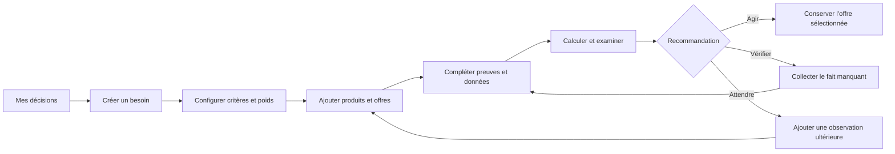

# DealFox — Parcours MVP mono-foyer

## Principe

Le MVP démarre immédiatement dans le contexte d'un seul foyer. Il n'y a ni inscription, ni sélection de compte, ni écran de collaboration : l'utilisateur ouvre ses décisions et agit.

## Parcours principal

## Étapes et résultats attendus

| Étape | Intention du foyer | Informations manipulées | Sortie obligatoire |
|---|---|---|---|
| Mes décisions | Retrouver ou démarrer une décision | Décisions actives et leur dernier état | Créer ou ouvrir une décision. |
| Créer un besoin | Exprimer le problème avant les produits | Catégorie, usages, budget, localisation, horizon, risque | Besoin complet ou champs à compléter. |
| Configurer le board | Dire ce qui compte vraiment | Critères, définitions, poids | Poids total de 100 ; board calculable. |
| Ajouter une offre | Capturer une possibilité concrète | Produit, variante, vendeur, état, prix, URL, date, confiance | Offre enregistrée avec preuve. |
| Compléter les données | Éviter les faux positifs | Disponibilité, garantie, accessoires, SAV, coûts et inconnues | Liste explicite des champs bloquants. |
| Examiner | Comprendre l'arbitrage | Score de board, indice v1, historique et risques | Recommandation expliquée. |
| Agir / vérifier / attendre | Choisir la prochaine action | Offre, preuve, risques, tâche de suivi | État de décision mis à jour sans effacer l'historique. |

## Règles d'expérience

- Une inconnue est visible comme inconnue, jamais transformée en note favorable ou défavorable sans explication.
- L'utilisateur peut enregistrer une offre incomplète, mais pas la déclarer prête à recommander.
- Le calcul est toujours consultable : notes, poids, formule et version restent accessibles à côté du résultat.
- Les actions `vérifier` et `attendre` donnent une prochaine étape concrète, par exemple vérifier un stock local ou attendre une observation comparable.
- Le foyer ne choisit jamais de destinataire ou de permission : la simplicité mono-foyer est un choix de périmètre, pas une omission temporaire de l'écran.

## Scénario de démo

1. Le foyer crée le besoin « vélo cargo familial à Anglet ».
2. Il importe manuellement le BTWIN R500E, le Fiido T2 et le Moma E-LONGTAIL reconditionné depuis les offres vérifiées.
3. Il constate que l'offre BTWIN est bien prouvée mais que le retrait local et les accessoires restent à confirmer.
4. Il voit que le Fiido est attractif en prix mais que le SAV local bloque une recommandation de faible risque.
5. Il obtient une décision `vérifier` avec les deux vérifications exactes à mener, plutôt qu'une alerte trompeuse ou une simple note globale.

## Hors parcours MVP

Le partage d'une décision avec un second foyer, les commentaires, les rôles, les invitations et les comptes multiples sont volontairement reportés. Ils deviendront un contexte distinct seulement après validation de la valeur du parcours mono-foyer.
