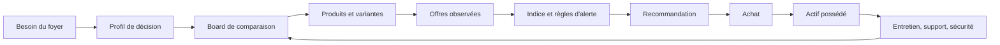

# DealFox — Product & Domain Map

## Produit

DealFox est un copilote de décision pour les achats comparables dans le temps. Il aide un foyer à cadrer un besoin, comparer des produits, surveiller des offres actionnables, décider avec le coût et le risque réels, puis apprendre de la possession.

Le vélo cargo familial et le VAE solo sont les deux premiers cas de recherche. Ils démontrent le produit ; ils ne limitent pas le domaine à la mobilité.

## Boucle de valeur

## Entités du noyau

| Entité | Rôle |
|---|---|
| Foyer | Porte les membres, actifs, localisation et contraintes partagées. |
| Besoin d'achat | Décrit le problème, les usages, l'horizon et le budget. |
| Profil de décision | Porte les critères, poids, tolérance au risque et préférences contextuelles. |
| Produit / variante | Objet comparable indépendamment d'une offre. |
| Offre | Proposition achetable : vendeur, canal, état, prix, configuration et disponibilité. |
| Observation et preuve | Fait horodaté, sourcé, avec niveau de confiance et fraîcheur. |
| Board / indice / recommandation | Évaluation explicable du produit, de l'offre et de l'action. |
| Achat / actif possédé | Passage vers le suivi réel de coût, support, entretien et revente. |

## Contexts métier

1. **Market Intelligence** : modèles, vendeurs, prix, stock, aides et sources.
2. **Decision Intelligence** : besoins, critères, scores, TCO et recommandations.
3. **Alerting** : seuils, déduplication et caractère actionnable des signaux.
4. **Ownership Intelligence** : montage, maintenance, SAV, sécurité et risque d'immobilisation.
5. **Household Portfolio** : actifs existants, complémentarité et remplacement.

## Extensions vélo déjà justifiées

- configuration famille et compatibilité des accessoires ;
- batterie, santé, disponibilité et remplacement ;
- composants standardisés ou propriétaires ;
- réparabilité locale distincte du SAV constructeur ;
- plan de sécurité selon stationnement et assurance ;
- TCO sur cinq ans et risque d'immobilisation.

## Règles de cadrage

- Un produit, une offre et une observation sont trois objets distincts.
- Une recommandation doit pouvoir exposer le meilleur choix technique, prudent, valeur et contextuel.
- Les offres sont distinguées entre neuf, reconditionné constructeur, reconditionné tiers et occasion privée.
- Le support local, le coût des accessoires et les risques de possession influencent la décision ; ils ne sont pas des détails post-achat.
- Une donnée non reconfirmée ne peut pas être présentée comme actuelle.

## Décisions encore nécessaires

- Utilisateur cible et modèle économique : outil personnel, service B2C ou offre B2B.
- Catégories à supporter après les vélos et frontière entre noyau générique et extensions verticales.
- Canal, fréquence et préférences de bruit des alertes.
- Méthode de collecte, fraîcheur des données et responsabilité des recommandations.
- Données réelles de SAV, autonomie, batterie et coûts de possession pour fermer la boucle d'apprentissage.
